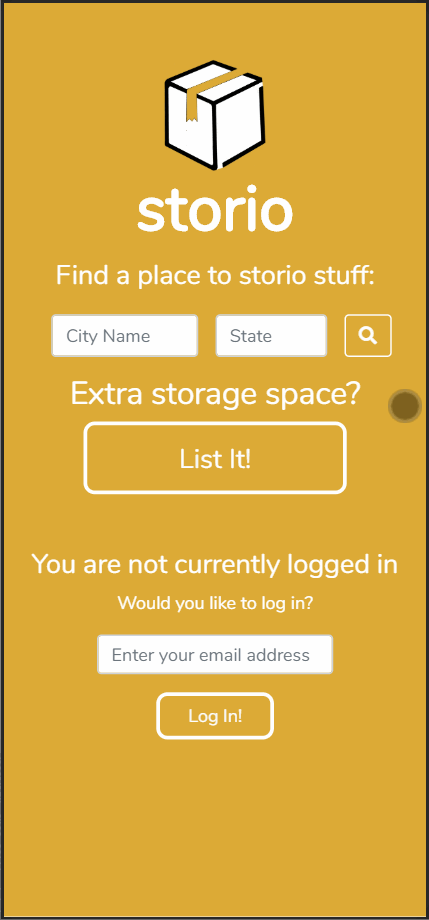
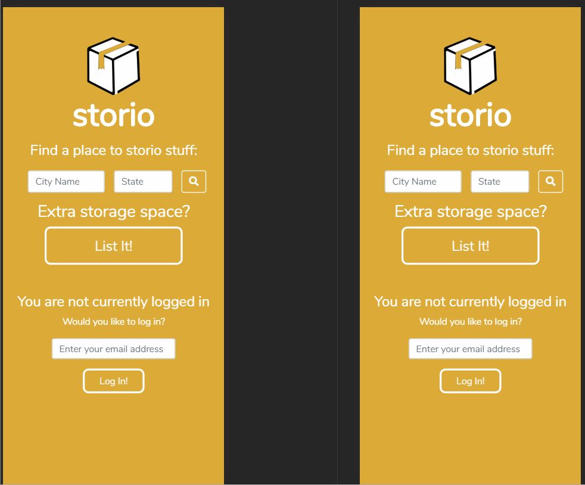

# Storio

## Description
A mobile-first application that connects people who have extra storage space with people who need a place to storio their stuff.

## Technologies Used
- React
- Webpack 4
- Bootstrap 4
- Node.js
- PostrgreSQL
- HTML5
- CSS3
- AWS EC2

## Live Demo

## Features
- User can sign in
- User can search for storages by city and state
- User can toggle between list view and map view to view all spaces
- User can view details of a space
- User can send message to host of space
- User can view list list of conversations
- User can list a space
- User can view list of their listings

## App Preview

## Development

### System Requirements

### Getting Started
